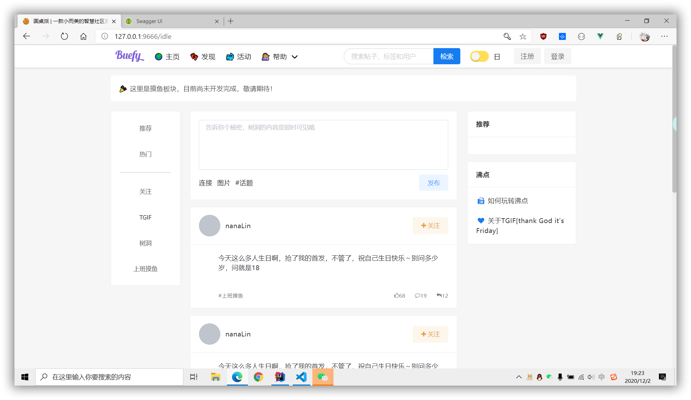
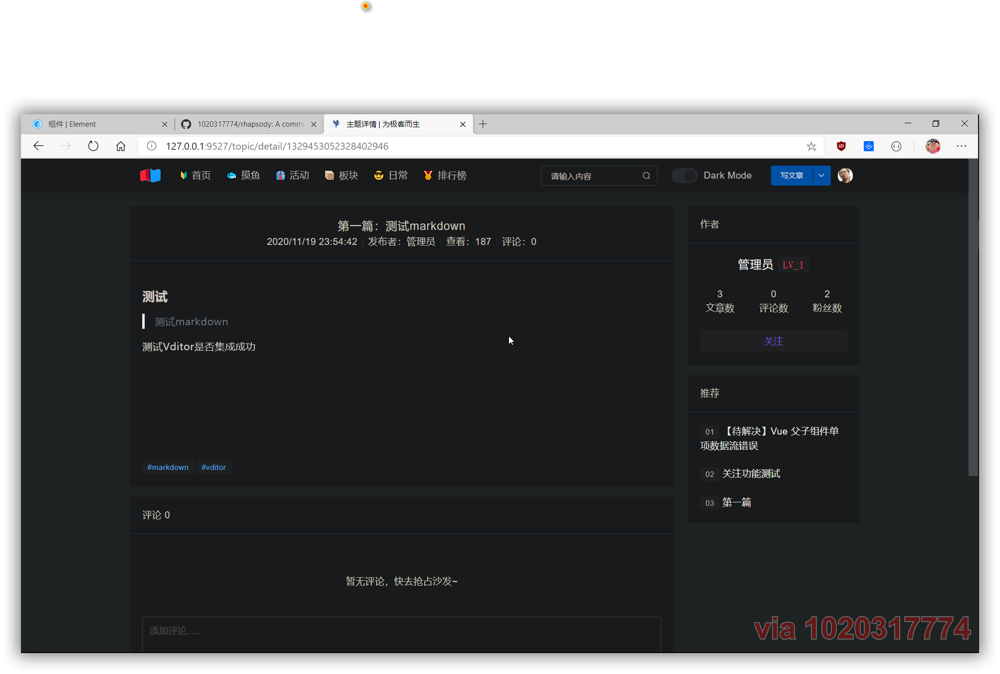
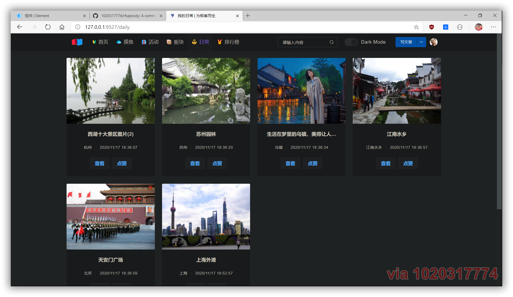
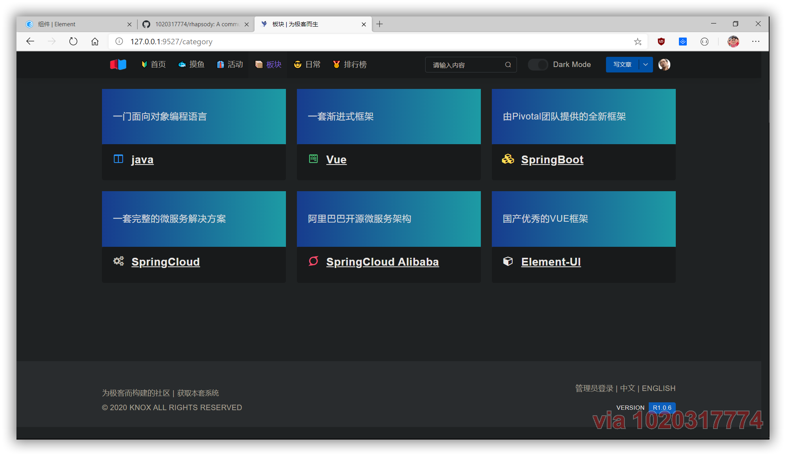
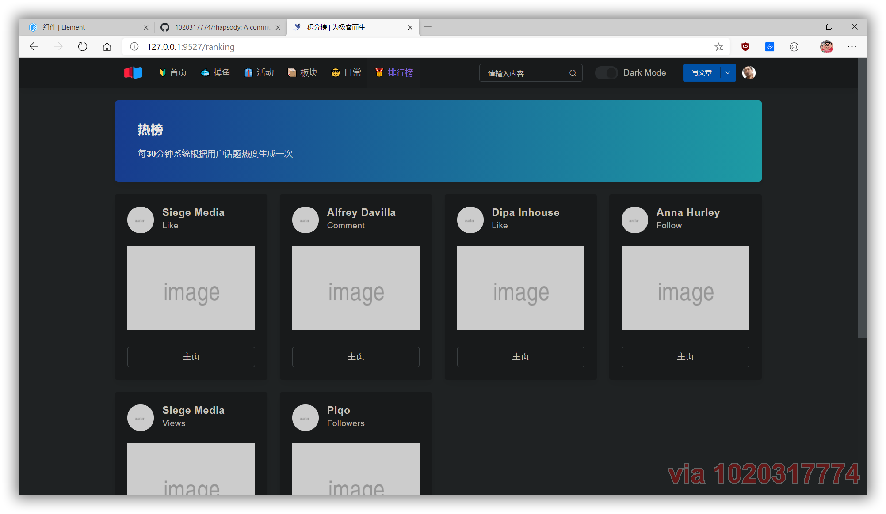
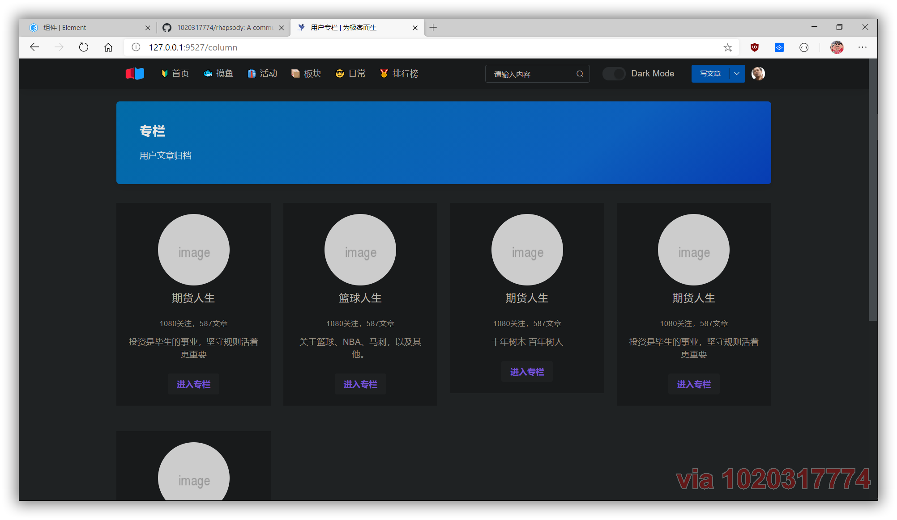

## 介绍

本套系统基于 `SpringBoot` 开发，与[https://github.com/1020317774/rhapsody](https://github.com/1020317774/rhapsody)搭配使用，效果更佳。

<div align="center">

<a href="https://github.com/1020317774/rhapsody-admin/stargazers"></a>
<a href="https://github.com/1020317774/rhapsody-admin/blob/main/LICENSE"></a>
<a href="https://github.com/1020317774/rhapsody-admin/blob/main/LICENSE"></a>

</div>

## 技术栈

- [x] SpringBoot 2.X
- [x] Mysql 8.X
- [x] Mybatis
- [x] MybatisPlus
- [x] Redis
- [x] FastJson
- [x] Hutool
- [x] Lombok
- [ ] ElasticSearch

……

## 安装指导

- 克隆
```java
git clone https://github.com/1020317774/rhapsody-admin.git
```

- 修改`application.properties`选择环境

- 修改多环境配置中的redis参数和数据库

- 启动`BootApplication`

- 访问[`http://127.0.0.1:9999`](http://127.0.0.1:9999)

## 版本预览














## 版权

Code copyright 2020 Q1020317774. Code released under [the MIT license](https://github.com/jgthms/bulma/blob/master/LICENSE).
