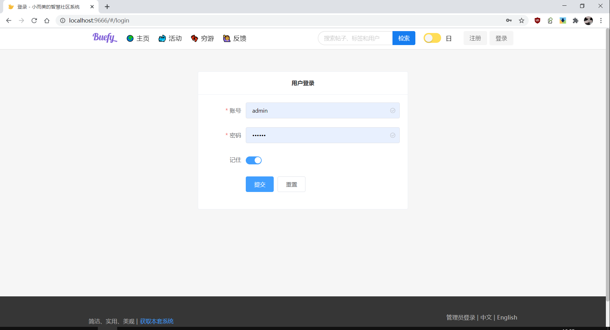
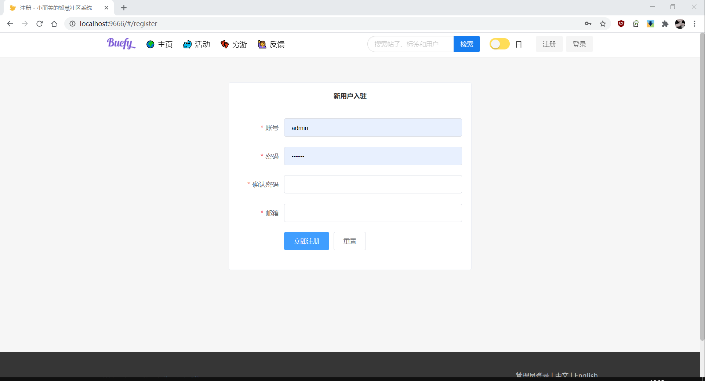
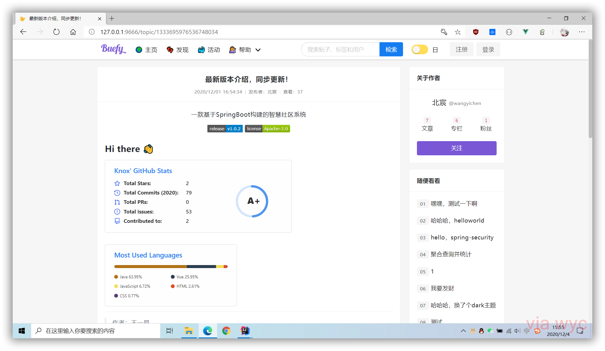
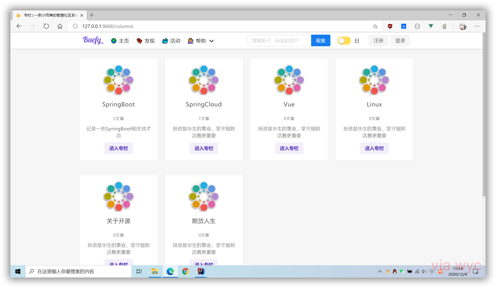

    <h2>Amor</h2>
    

        一套前后端分离的极简社区系统，采用RESTFul风格构建。
    

    

        
        
    

    

        <a href="./README.md">简体中文</a>
        ·
        <a href="./README_EN.md">English</a>
    

> 如果发现了bug或者有好的建议，欢迎提issue，想参与的朋友也欢迎 PR

## 技术栈

- [x] Spring Boot
- [x] Spring Security
- [x] JWT
- [x] Mysql
- [x] Mybatis
- [x] MyBatis-Plus
- [x] Flyway
- [x] Elasticsearch
- [x] Redis
- [x] Swagger
- [x] Lombok
- [x] Hutool
- [x] FastJson
- [ ] JustAuth

## 安装指导

- 克隆当前项目

- 修改`application.yaml`切换开发环境

- 修改数据库及redis参数

- 启动`Application`

- 访问[`http://127.0.0.1:10000`](http://127.0.0.1:10000)

## 版本预览
- 登录   
  
  

- 注册
  
  
  
- 首页
  
  

- 活动
  
  

- 摸鱼
  
  

- 详情
  
  

- 评论
  
  

- 专栏
  
  

- 专栏详情
  
  

- swagger
  
  

## LICENSE

Copyright 2020-present. Knox. Code released under [the Apache license](LICENSE).
