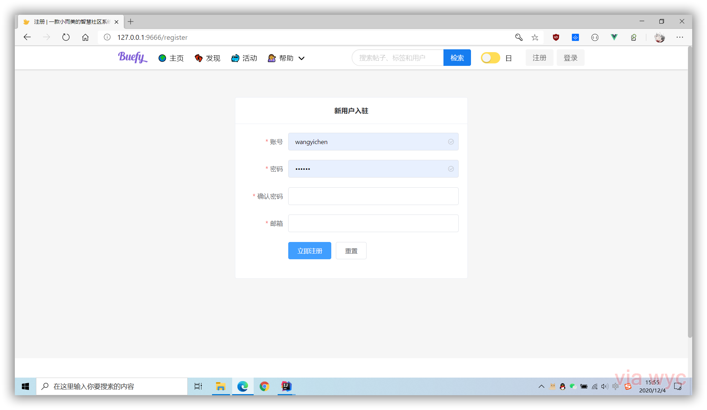

<div align="center">
    <h2>buefy-admin</h2>
    <p>
        一款基于SpringBoot构建的智慧社区系统，与<a href="https://github.com/1020317774/rhapsody" target="_blank">rhapsody</a>搭配使用，效果更佳。
    </p>
    <p>
        <a href="https://github.com/1020317774/buefy-admin/stargazers"></a>
        <a href="https://github.com/1020317774/buefy-admin/blob/main/LICENSE"></a>
    </p>
    <p>
        <a href="./README.md">简体中文</a>
        ·
        <a href="./README_EN.md">English</a>
    </p>
</div>

## 技术栈

- [x] Spring Boot
- [x] SpringSecurity
- [x] JWT
- [x] Mysql
- [x] Mybatis
- [x] MyBatis-Plus
- [x] Flyway
- [x] Elasticsearch
- [x] Redis
- [x] Swagger
- [x] Lombok
- [x] Hutool
- [x] FastJson
- [ ] JustAuth


## 安装指导

- 克隆
```java
git clone https://github.com/1020317774/buefy-admin.git
```

- 修改`application.properties`选择环境

- 修改多环境配置中的redis参数和数据库

- 启动`BootApplication`

- 访问[`http://127.0.0.1:10000`](http://127.0.0.1:10000)

## 版本预览





## 版权

Code copyright 2020 QQ:1020317774. Code released under [the MIT license](https://github.com/jgthms/bulma/blob/master/LICENSE).
