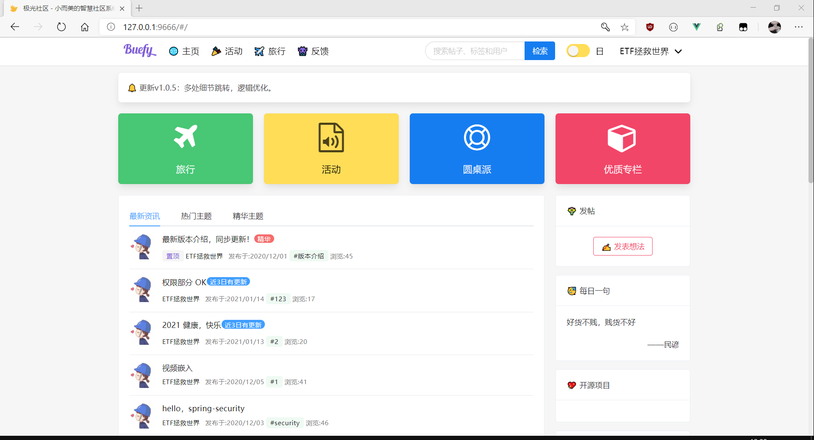
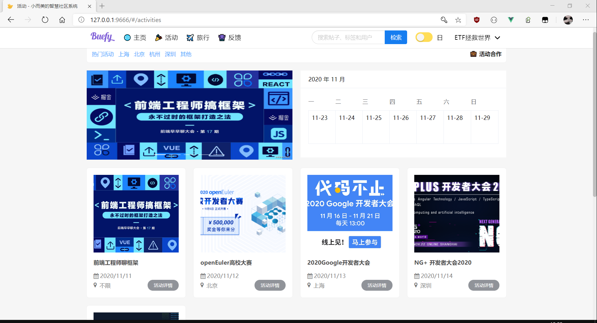
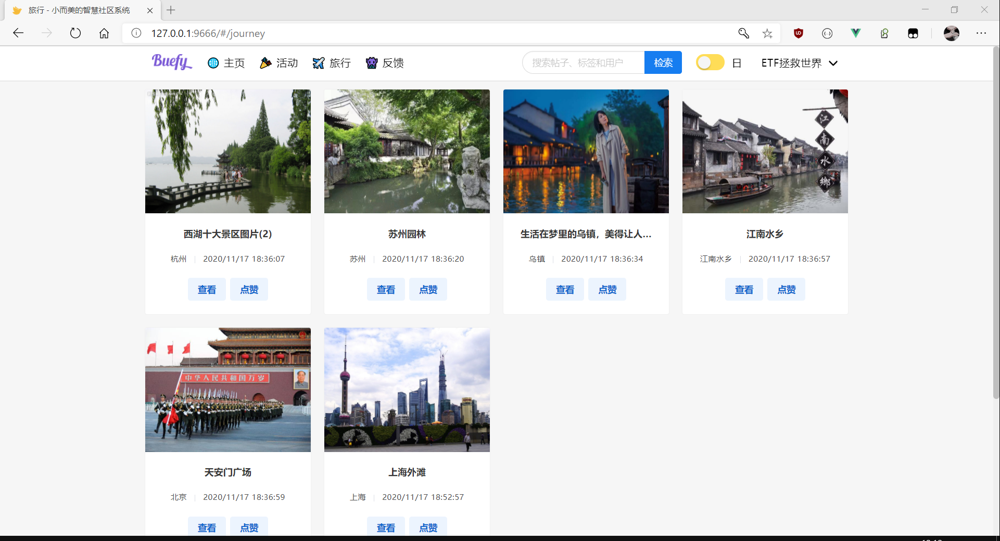
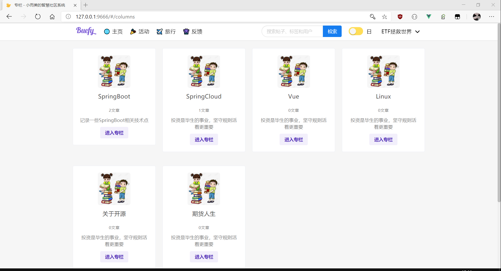
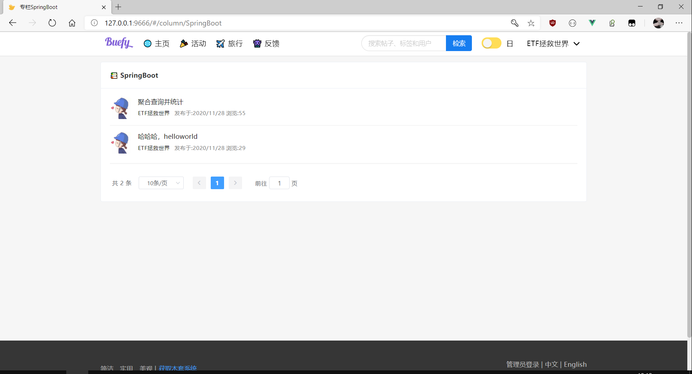
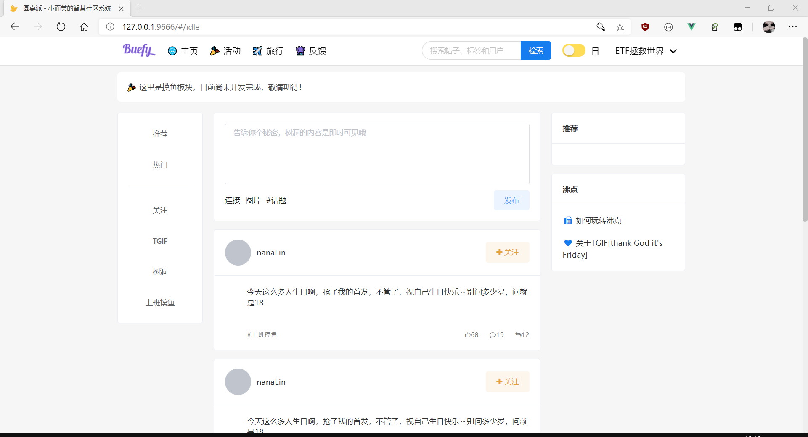
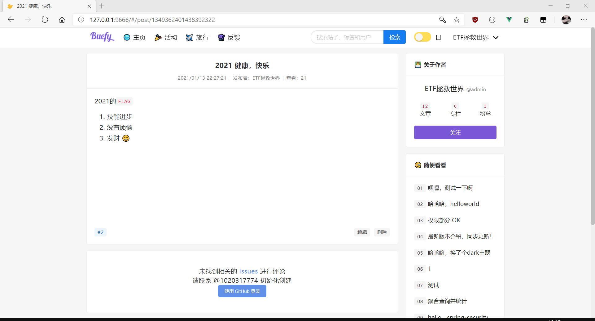
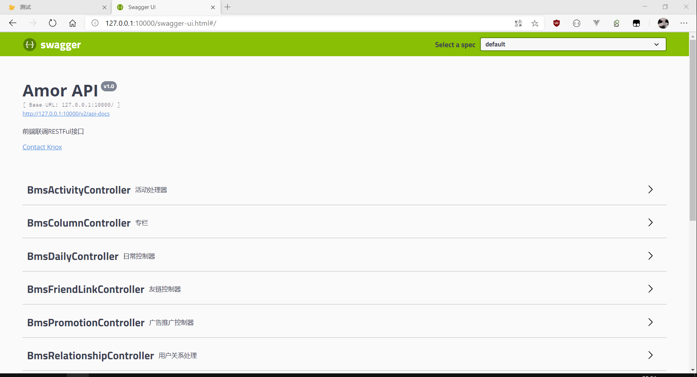

<h2>Aurora：极光社区</h2>

一套前后端分离的极简社区系统，采用RESTFul风格构建。
     

前端地址:<a href="https://github.com/1020317774/aurora-vue">Aurora-vue</a>

<a href="./README.md">简体中文</a>&nbsp;&nbsp;-&nbsp;&nbsp;<a href="./README_EN.md">English</a>

> 欢迎`star`&`fork`，使用中发现`bug`请提`issue`，想参与项目开发的朋友欢迎`fork`&`pull request`。

## 技术栈

- [x] Spring Boot
- [x] Mysql
- [x] Mybatis
- [x] MyBatis-Plus
- [x] Spring Security
- [x] JWT
- [x] Flyway
- [x] Elasticsearch
- [x] Redis
- [x] Swagger
- [x] Lombok
- [x] Hutool
- [x] FastJson
- [ ] JustAuth

## 使用指导

- 克隆当前项目到本地

- 创建本地数据库：`aurora`

- 修改`application.yaml`
  - `db`：username & password
  - `redis`：host & password

- 启动`AuroraApplication`

- 访问[`http://127.0.0.1:8000`](http://127.0.0.1:10000)

## 版本预览
- 登录   
  
  

- 注册
  
  

- 会话
  
  
- 首页
  
  

- 活动
  
  

- 旅行

  

- 专栏

  
  
  

- 摸鱼-仿掘金
  
  

- 详情
  
  

- swagger
  
  

## 许可

Copyright 2020-present. Knox. Code released under [the Apache license](LICENSE).
